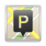

# Dude, where's my parking? 

Mobile application for easier parking spot finding.
Find free parking spots near you or near any other place you want.

## How it works?

This app functions for the community but it also needs community because users are those who mark spots as free or taken.
But, for being such good guys and actually doing that, they will be rewarded with points.

Be a good guy / girl, mark parking spots, collect points and get rewards!  :innocent: :smile:  :gift:

## Development stack

Main packages used in development:
* [**React Native** (0.42)](http://facebook.github.io/react-native/releases/0.42/ "Documentation")
* [**React Native Maps**](https://github.com/airbnb/react-native-maps "Documentation")
* [**React Native Google Places Autocomplete**](https://github.com/FaridSafi/react-native-google-places-autocomplete "Documentation")
* [**React Native Material UI**](https://github.com/xotahal/react-native-material-ui "Documentation")
* [**React Navigation**](https://reactnavigation.org/ "Documentation")
* [**Redux**](http://redux.js.org/ "Documentation")
* [**Eslint**](http://eslint.org/ "Documentation")

For other packages used, check out package.json in project files.